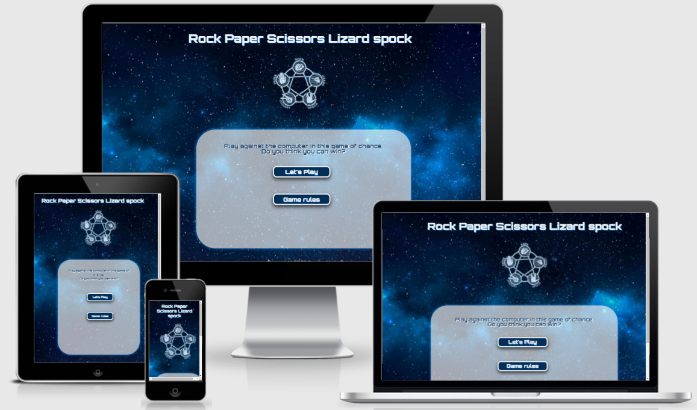

# Rock, Paper, Scissors, Lizard, Spock.

## **[Live link to Game](https://charte-dot.github.io/Rock-Paper-Scissors-Lizard-Spock/)**

# Table of contents:
 -   [Context](#context)
 -   [UX Design](#UX-Design)

 ---

  # Context
  "Rock, Paper, Scissors, Lizard, Spock" was inspired by the game featured in the show  **[The Big Bang Theory](https://the-big-bang-theory.com/rock-paper-scissors-lizard-spock/)**. This game is an online virtual version of the hand gesture game spoke about on the show. The game is for all ages as you play against the computer. It will challenge you as the added twist of dropping a point if the player draws the same choice as the computer.

  The game is simple:
  - The game rules explain the button symbols for players who might of not heard of or played this variation of the game rock, paper, scissors.
  - Player chooses and option from the buttons displayed, rock, paper, scissors, lizard & spock.
  - The computer is set up to randomly choose an option, so results are different everytime.
  - If the player wins they are rewarded with one point.
  - If the player looses the computer is rewarded with one point.
  - If both the player and computer draw, both loose a point.
  - First to get to 10 points wins.
  - Then the player can restart the game or exit.

  As there are no extra levels to this game, I'v made it a bit more of a challenge by loosing a point with both player and computer draw the same. This adds lenght to the game, while also making the player think and choose with care which symbol they want to play next.

  ---

  # UX Design

  

  

