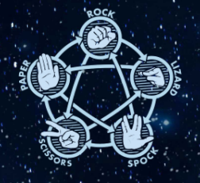

# Rock, Paper, Scissors, Lizard, Spock.

## **[Live link to Game](https://charte-dot.github.io/Rock-Paper-Scissors-Lizard-Spock/)**

# Table of contents:
 -   [Context](#context)
 -   [UX Design](#UX-Design)
        - [Target audience](#Target-audience)
        - [Overview](#Overview)
        - [User Stories](#User-stories)
        - [Wireframes](#wireframes)
        - [Design choices](#Design-choices)
        - [Background](#Background)
        - [Colors](#Colors)
        - [Game Logo](#Game-logo)
        - [Fonts](#Fonts)
        - [Icons](#Icons)
 -   [Features](#Features)
        - [Main heading](#main-heading)
        - [main area](#main-area)
        - [Rules section](#rules-section)
        - [Main game](#main-game)
        - [Score display](#score-display)
        - [End game](#End-game)
        - [Features to implement](#features-to-implement)

 ---

  # Context
  "Rock, Paper, Scissors, Lizard, Spock" was inspired by the game featured in the show  **[The Big Bang Theory](https://the-big-bang-theory.com/rock-paper-scissors-lizard-spock/)**. This game is an online virtual version of the hand gesture game spoke about on the show. The game is for all ages as you play against the computer. It will challenge you as the added twist of dropping a point if the player draws the same choice as the computer.

  The game is simple:
  - The game rules explain the button symbols for players who might of not heard of or played this variation of the game rock, paper, scissors.
  - Player chooses and option from the buttons displayed, rock, paper, scissors, lizard & spock.
  - The computer is set up to randomly choose an option, so results are different everytime.
  - If the player wins they are rewarded with one point.
  - If the player looses the computer is rewarded with one point.
  - If both the player and computer draw, both loose a point.
  - First to get to 10 points wins.
  - Then the player can restart the game or exit.

  As there are no extra levels to this game, I'v made it a bit more of a challenge by loosing a point with both player and computer draw the same. This adds lenght to the game, while also making the player think and choose with care which symbol they want to play next.

  ---

  # UX Design

  ## Target audience
  - Anyone who is a fan of The Big Bang Theory
  - People who enjoy games
  - New users that would like to try a new game

  ## Overview
  - Simple design
  - Intuitive navigation
  - Satisfying feedback
  - Fun and interactive application.

  ## User stories

  - First time user:
  1. To be able to access the application with ease.
  2. Have clear navigation.
  3. Easy to read and understand instructions.
  4. Fun interactive application

  - Returning user:
  1. To be entertained.
  2. Navigate with ease
  3. Satisfying visuals
  4. Clear easy path to starting and restarting the game.

  - As site owner:
  1. To be able to customise the look and feel of the site with ease.
  2. To make a fun and entertaining application
  3. To make sure the user has fun using the application.

  ## Wireframes

I designed a basic wireframe first.This was to give me a template to follow and to make sure my original design that I had planned was the outcome and final layout of the application. The layout of the application is the same across all mobile, just resized to fit the device screen. 

## Design choices

### Background
My main objective for the background of the game was to be space themed as The Big Bang Theory has space and science references throughout the show and one of the symbols within the game "Spock" was a charater on Star Trek, another space themed show.
I needed the background to be complimentary and undistracting from the game. The background I chose came from **[Unsplash](https://unsplash.com/photos/qwoW4mdqjWw)** as it is an amazing photograph of the Milky Way. The original image was too large in size, so I used a tool called **[Tiny Png](https://tinypng.com//)** to compress the image to a smaller file size to help with the page load time. 

### Colors
The colours I used to style elements within game came from with the background. I used eye dropper chrome extention, this allows you to accurately focus in on a colour from a webpage or document. This tool helped to pick colors from the background and tie the background in subtly throughout the game. 
- Main text heading and borders: White smoke.
- Text background: Dodger blue.
- Background for buttons and in game message/results: Midnight blue.

### Game logo

 
 
 I decided after much research that I wanted to add a logo to the game, visual instructions of the game. I sourced this logo from
**[Code golf and challenges](https://codegolf.stackexchange.com/questions/195083/cheat-at-rock-paper-scissors-lizard-spock)**. The original image although it was what I was looking for didn't fit into the style of the game. I used a background removal tool called **[Clipping magic](https://clippingmagic.com/)** to take away the dark navy background of the original image. As the original image is turquoise blue it clashed with the space background on the game. With a recolor tool called **[Pine tools](https://pinetools.com/colorize-image)** I recolored the image to fit in the the design and look of the page. 

### Fonts
- For the font I used Google Fonts. 
- I used **[Orbitron](https://fonts.google.com/specimen/Orbitron?preview.text=The%20Authentic%20American%20Car%20Club&preview.text_type=custom&query=orbit)** font throughout the whole application to keep it simple and consistant.
- Backup font I set it as Sans serif.

### Icons
I used basic Icons from Font Awesome for the symbols on the player buttons.
- **[Rock](https://fontawesome.com/v5/icons/hand-rock?s=solid)**
- **[Paper](https://fontawesome.com/v5/icons/hand-paper?s=solid)**
-  **[Scissors](https://fontawesome.com/v5/icons/hand-scissors?s=solid)**
- **[Lizard](https://fontawesome.com/v5/icons/hand-lizard?s=solid)**
- **[Spock](https://fontawesome.com/v5/icons/hand-spock?s=solid)**
 
 I styled the Icons within CSS stylesheet to match with the overall theme of the application.
 
 ---
 
 # Features 
 ## Main heading
 
 
 
  - The main heading on the application is a simple text of the game name in bright bold text styled to stand out from the background but not to take away from the over all application. It is clear and allows the user to see what the name of the game is.
---

## Main game area
 

 - The main game area is where the game takes place. From the landing page right through to the end page of the game. It has a simple opening statement inviting the user to play. Located in the centre of the game area is the play button to start the game and game rules button to open the rules section allowing the user to see the rules of the game and how to play.

 ----

 ## Rules section
 

 - If the user clicks on the game rules button, the rules/instructions are displayed on the screen. It explains with symbols what the option will be within the game. Beneath that there is a list of which game choice beats the other game choices. The points system is then explained below this to allow the user to understand how the points are calculated within the game. At the very end of the rules is a close button. When the user clicks this button the rules section closes and the user is back at the main screen where the play button is located.

 ---

 ## Main game
 

 - When the user clicks the start button, the main game is displayed. A simple design containing everything the player needs to play the game. An instruction text invites the user to select a button to start. Upon selecting a button the game has started and the instruction text then changes to display which option the user has selected and the computer choice. This also displays a win, lose or draw notifying the user the outcome of that choice.

 ---

 ## Score display
 

 - A simple score display is located at the top of the game area. This shows user score and computer score and updates upon each option choosen within the game.

 ---

 ## End game

- When the score either by the user or computer reaches 10 point on the score board the game ends. It displays the outcome of the game via text and invites the user to play again. The play again button when clicked restarts the game and the user is straight back into a new game.

---

## Features I would like to implement in the future.
- I would like to implement a timer to time the game, adding another level of difficulty to the game.
- I would like to add another level to the game, givig the user another option to choose from.
- I would like to add sound effects to the game.
- I would have like to have added a high score board with name entry to keep track of high scores.

  

  

